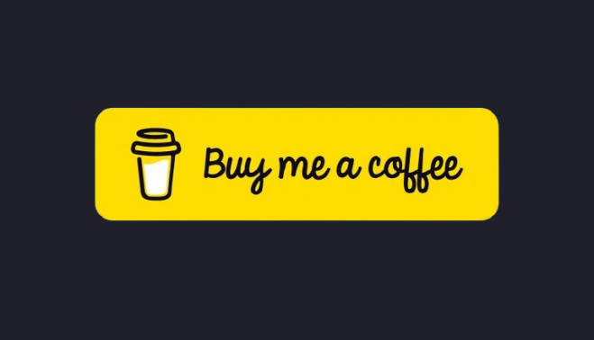

# Pour me soutenir dans mon travail 👍👍👍

**Si vous avez aimé le contenu de ce site, vous pouvez m'offir un café ☕ en suivant le lien ci-dessous :** ⤵️

## Pourquoi me soutenir ? 🤔

Vous l’avez peut-être remarqué, ce site ne diffuse aucune publicité 🚫. Pour le financer, je compte essentiellement sur le soutien de mes lecteurs. ❤️

### Pour quels objectifs ? 🎯

Mon **principal objectif** est de **fournir un contenu accessible et utile** à tous.

## Comment me soutenir ? 🙌

**Chaque don compte, les petits comme les gros**. Vous pouvez effectuer un don :

-   **Ponctuel** ou **mensuel** sur mon compte [**ko-fi** ↗️](https://ko-fi.com/ndu69).
    
## Pourquoi ?

**Vous allez me dire, mais pourquoi te soutenir ? Quelles sont tes dépenses ?** 🤷‍♂️ Vos dons permettent de couvrir **les dépenses liées à l’hébergement du blog** ainsi qu'au **maintien de mon homelab** 💼 (tout cela pour un montant mensuel de 100€ environ pour les dépenses fixes).

**Merci à tous ceux qui m’ont soutenu et à ceux qui vont le faire.** 👏
